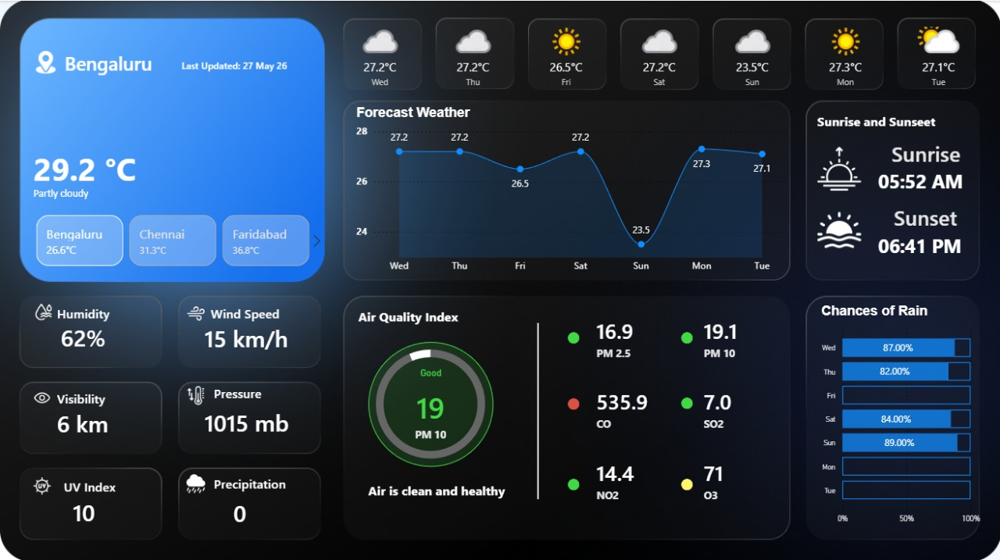
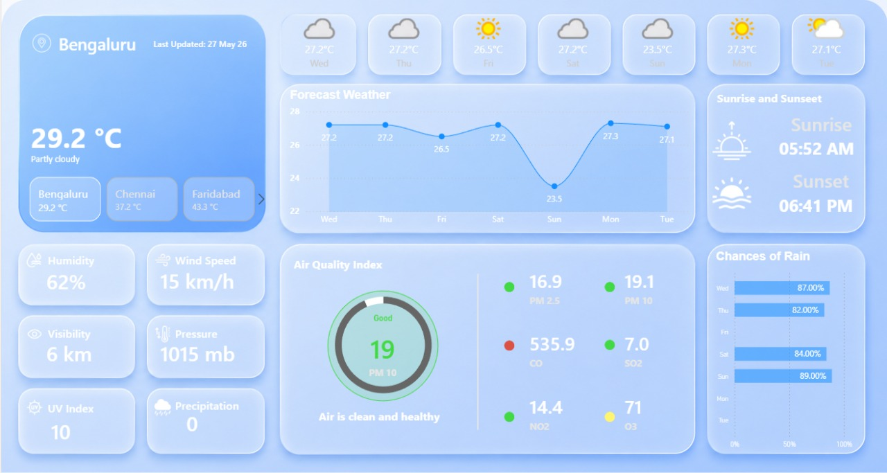

#  Weather Analytics Dashboard | Power BI Project

An interactive **real-time Weather Analytics Dashboard** built using **Power BI**, **WeatherAPI**, **Power Query**, and **DAX**.  
This dashboard provides live weather updates, 7-day forecasts, air quality insights, and environmental metrics for multiple Indian cities.

---

#  Project Overview

This project demonstrates how to integrate a live weather API into Power BI and transform nested JSON data into meaningful visual analytics.

The dashboard includes:

-  Current Temperature
-  Weather Condition
-  7-Day Forecast
-  Sunrise & Sunset
-  Wind Speed
-  Humidity
-  Visibility
-  Air Quality Index (AQI)
-  Rain Probability
-  UV Index
-  Multi-city Monitoring

---

#  Dashboard Preview

## Dark Theme


## Light Theme


---

#  Features

##  Real-Time API Integration
Connected Power BI with WeatherAPI for live weather updates.

##  Dynamic AQI Monitoring
- AQI Status
- AQI Color Indicators
- Health Suggestions
- Pollutant Breakdown

##  7-Day Forecast
Interactive temperature trend analysis using line charts.

##  Multi-City Support
Dashboard supports multiple cities including:
- Chennai
- Bengaluru
- Hyderabad
- Faridabad
- Lucknow
- Indore

##  Modern UI/UX
- Glassmorphism Design
- Dark & Light Theme
- Responsive Card Layout
- Modern Weather App Style

---

#  Tools & Technologies

| Tool | Purpose |
|------|---------|
| Power BI | Dashboard Development |
| Power Query | Data Transformation |
| DAX | Dynamic Calculations |
| WeatherAPI | Live Weather Data |
| JSON | API Response Format |

---

#  API Used

Weather data collected using:

```text
http://api.weatherapi.com/v1/forecast.json
```

Example API Request:

```text
http://api.weatherapi.com/v1/forecast.json?key=YOUR_API_KEY&q=indore&days=7&aqi=yes&alerts=no
```

---

#  Data Processing Workflow

## Step 1 — API Connection
Connected WeatherAPI using Power Query:

```powerquery
Json.Document(
    Web.Contents(
        "http://api.weatherapi.com/v1/forecast.json?key=YOUR_API_KEY&q=indore&days=7&aqi=yes&alerts=no"
    )
)
```

---

## Step 2 — JSON Transformation
Expanded nested records:
- location
- current
- forecast
- forecastday
- hour
- air_quality

---

## Step 3 — Data Modeling
Created:
- Current Weather Table
- Forecast Day Table
- Forecast Hour Table
- Master City Table

---

## Step 4 — DAX Calculations
Created dynamic measures for:
- AQI Classification
- Temperature Metrics
- Conditional Formatting
- Dynamic Suggestions

---

# Important DAX Measures


```DAX
Curr_Temp_C = SUM('Current'[current.temp_c]) & " °C"

Curr_Temp_f = SUM('Current'[current.temp_f]) & " °F"

last_update = "Last Updated, " & FORMAT(FIRSTNONBLANK('Current'[current.last_updated], ""), "dd mmm")

For_Temp_C = AVERAGE(Forcast_Day[forecast.forecastday.day.avgtemp_c]) & " °C"

AQI_Status_Text = 
    VAR AQI = ROUND(SELECTEDVALUE('Current'[current.air_quality.pm10]),0)
    RETURN SWITCH(
        TRUE(),
        AQI <= 50, "Good",
        AQI <= 100, "Moderate",
        AQI <= 150, "Unhealthy for Sensitive",
        AQI <= 200, "Unhealthy",
        AQI <= 300, "Very Unhealthy",
        "Hazardous"
    )

AQI_Color_PM10 = 
    VAR AQI = ROUND(SELECTEDVALUE('Current'[current.air_quality.pm10]),0)
    RETURN SWITCH(
        TRUE(),
        AQI <= 50, "#43d946",   -- Good (Green)
        AQI <= 100, "#fff570",  -- Moderate (Yellow)
        AQI <= 150, "#ff9800",  -- Poor (Orange)
        AQI <= 200, "#d99343",  -- Unhealthy (Red)
        AQI <= 300, "#ff5b0f",  -- Severe (Purple)
        "#d95243"               -- Hazardous (Dark Maroon)
    )

AQI_Suggestion = 
    VAR AQI = SELECTEDVALUE('Current'[current.air_quality.pm10])
    RETURN SWITCH(
        TRUE(),
        AQI <= 50, "Air is clean and healthy",
        AQI <= 100, "Acceptable air quality, stay active",
        AQI <= 150, "Sensitive groups should reduce outdoor time",
        AQI <= 200, "Limit prolonged outdoor exertion",
        AQI <= 300, "Avoid outdoor activity if possible",
        "Stay indoors, wear mask if outside"
    )

Left_Rain_Chance = 100 - SUM(Forcast_Day[forecast.forecastday.day.daily_chance_of_rain])

avg_day_Temp_c = SUM(Forcast_Day[forecast.forecastday.day.avgtemp_c])

avg_hour_Temp_c = SUM(Forcast_Hour[forecast.forecastday.hour.temp_c])

PM10_Left = 300 - SUM('Current'[current.air_quality.pm10])

AQI_Color_CO = 
    VAR AQI = ROUND(SELECTEDVALUE('Current'[current.air_quality.co]),0)
    RETURN SWITCH(
        TRUE(),
        AQI <= 50, "#43d946",
        AQI <= 100, "#fff570",
        AQI <= 150, "#ff9800",
        AQI <= 200, "#d99343",
        AQI <= 300, "#ff5b0f",
        "#d95243"
    )

AQI_Color_SO2 = 
    VAR AQI = ROUND(SELECTEDVALUE('Current'[current.air_quality.so2]),0)
    RETURN SWITCH(
        TRUE(),
        AQI <= 50, "#43d946",
        AQI <= 100, "#fff570",
        AQI <= 150, "#ff9800",
        AQI <= 200, "#d99343",
        AQI <= 300, "#ff5b0f",
        "#d95243"
    )

AQI_Color_O3 = 
    VAR AQI = ROUND(SELECTEDVALUE('Current'[current.air_quality.o3]),0)
    RETURN SWITCH(
        TRUE(),
        AQI <= 50, "#43d946",
        AQI <= 100, "#fff570",
        AQI <= 150, "#ff9800",
        AQI <= 200, "#d99343",
        AQI <= 300, "#ff5b0f",
        "#d95243"
    )

AQI_Color_NO2 = 
    VAR AQI = ROUND(SELECTEDVALUE('Current'[current.air_quality.no2]),0)
    RETURN SWITCH(
        TRUE(),
        AQI <= 50, "#43d946",
        AQI <= 100, "#fff570",
        AQI <= 150, "#ff9800",
        AQI <= 200, "#d99343",
        AQI <= 300, "#ff5b0f",
        "#d95243"
    )

AQI_Color_PM2_5 = 
    VAR AQI = ROUND(SELECTEDVALUE('Current'[current.air_quality.pm2_5]),0)
    RETURN SWITCH(
        TRUE(),
        AQI <= 50, "#43d946",
        AQI <= 100, "#fff570",
        AQI <= 150, "#ff9800",
        AQI <= 200, "#d99343",
        AQI <= 300, "#ff5b0f",
        "#d95243"
    )

Humidity = SUM('Current'[current.humidity]) & " %"

Wind_Speed = SUM('Current'[current.wind_kph]) & " Kph"

Visibility = SUM('Current'[current.vis_km]) & " KM"

Pressure = SUM('Current'[current.pressure_mb]) & " mm"

UV_Index = SUM('Current'[current.uv])

Precipitation = SUM('Current'[current.precip_mm]) & " mm"
```
---

## Current Temperature

```DAX
Curr_Temp_C =
SELECTEDVALUE('Current'[current.temp_c]) & " °C"
```

---

#  Dashboard Components

| Component | Description |
|-----------|-------------|
| Weather Card | Current weather summary |
| Forecast Cards | 7-day weather forecast |
| Line Chart | Temperature trend |
| AQI Gauge | Air quality visualization |
| Pollutant Metrics | PM2.5, PM10, CO, NO2, O3 |
| Rain Forecast | Daily rain probability |
| Sunrise/Sunset | Daily solar timings |

---

#  Dashboard Themes

##  Light Theme
Clean glassmorphism UI with soft weather aesthetics.

##  Dark Theme
Modern premium dark-mode weather analytics experience.

---

#  Key Learnings

Through this project, I learned:

- API Integration in Power BI
- JSON Data Transformation
- Power Query ETL Process
- Advanced DAX Calculations
- Dynamic Conditional Formatting
- Dashboard UI/UX Design
- Real-Time Data Visualization

---

#  Future Improvements

Planned enhancements:
- Live Map Integration
- Weather Alerts
- Mobile Layout Optimization
- Dynamic Weather Animations
- Hourly Forecast Analysis
- Global City Search
- Auto Refresh Support

---

# Project Structure

```text
PROJECT_2/
│
├── icon-black/                   # Black minimal icons for light-themed layouts
│   ├── humidity.png
│   ├── location (3).png
│   ├── location.png
│   ├── rainy.png
│   ├── sunrise (2).png
│   ├── sunrise.png
│   ├── temperature.png
│   ├── uv-index.png
│   ├── visibility.png
│   └── windy.png
│
├── icon-white/                   # White minimal icons for dark-themed layouts
│   ├── humidity.png
│   ├── location.png
│   ├── rainy (1).png
│   ├── sunrise (1).png
│   ├── sunrise (3).png
│   ├── temperature (1).png
│   ├── uv-index (1).png
│   ├── visibility.png
│   └── windy.png
│
├── images/                       # UI design theme assets
│   ├── dark-theme.png
│   ├── light-theme_black-text.png
│   └── light-theme.png
│
├── wallpaper/                    # Background layouts for report canvas
│   ├── dark_background.png
│   └── light_background.png
│
├── p2.pbix                       # Main Power BI Desktop report file
└── README.md                     # Project documentation (this file)
```

---

## Contributing
This is a personal learning portfolio, but suggestions and feedback are welcome!

---

*Made with ❤️*