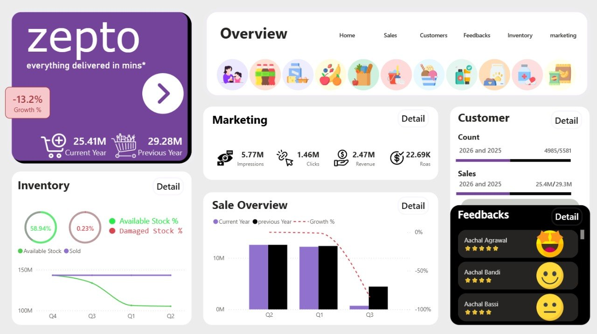
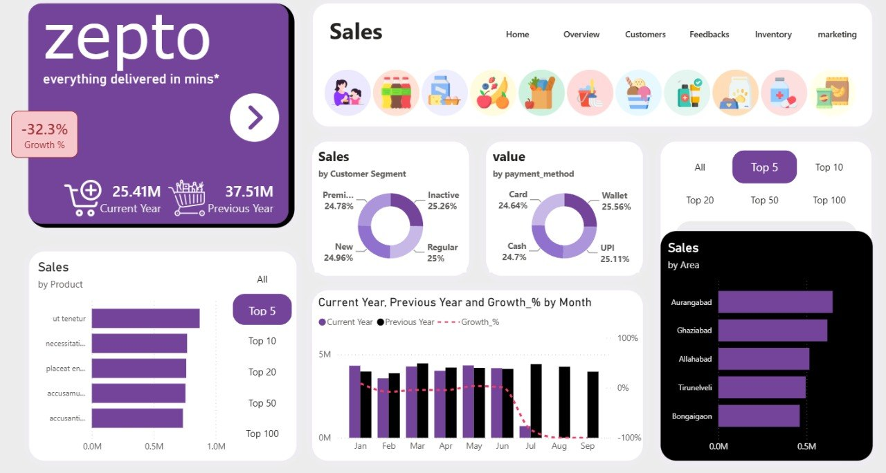
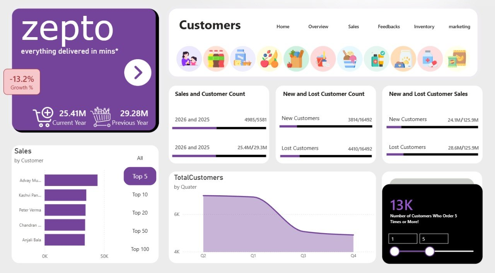
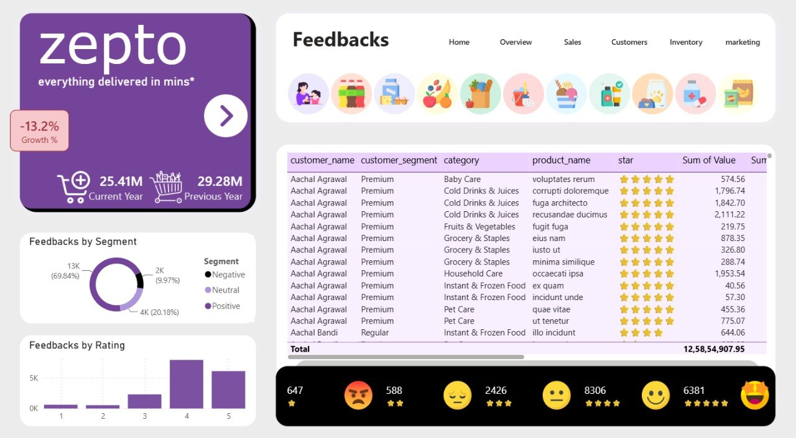
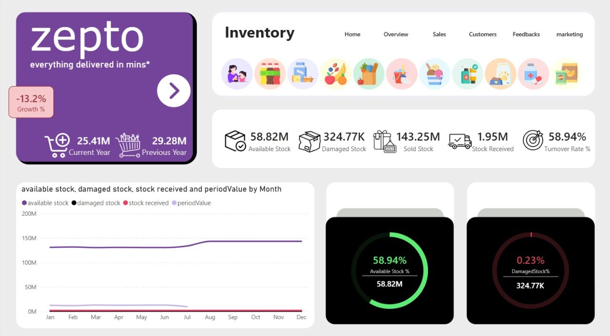
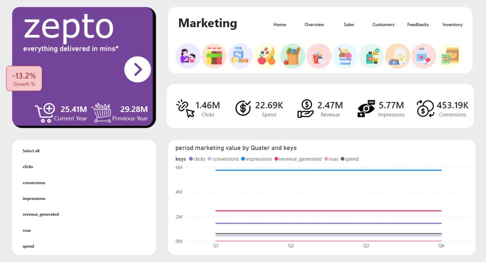
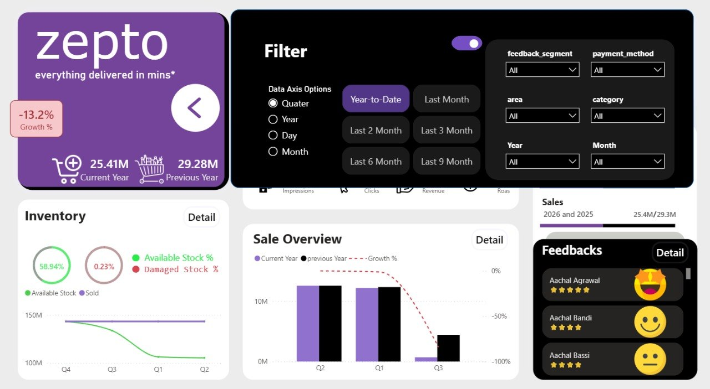

# Zepto Dashboard

## Overview

The Zepto Dashboard is an interactive Power BI project designed to analyze delivery performance, customer feedback, inventory, and marketing metrics for Zepto.

The dashboard provides insights on orders, customers, revenue, inventory, and campaign effectiveness while allowing users to explore time-based comparisons and filter data interactively.

---

```text
Project_5/
│
├── zepto.pbix
├── zepto.sql
├── bg_images/
├── Icon/
└── screenshots/
```

---

## Dashboard Screenshots

### Home Page

Landing page with Zepto branding, year-over-year sales highlights, and navigation to dashboard sections.

### Overview Page

Executive summary view with KPIs for marketing, customers, inventory, sales, and feedback sentiment.

### Sales Page

Sales analysis page showing product performance, customer segments, payment methods, and area-based trends.

### Customers Page

Customer view focusing on acquisition, churn, repeat buyer metrics, and customer value trends.

### Feedbacks Page

Feedback insights page showing sentiment distribution, ratings breakdown, and detailed feedback entries.

### Inventory Page

Inventory analytics page with stock availability, damaged stock, received stock, and trend indicators.

### Marketing Page

Marketing performance page with impressions, clicks, conversions, revenue, and ROAS metrics.

### Filter Pane

Filter pane view for time period selection and data slicers on feedback segment, payment method, area, and category.

---

## Dashboard Features

### Home Page
- Zepto branded landing page
- Summary of current year vs previous year sales and growth
- Navigation menu for all dashboard views
- Quick access to report sections

### Overview Dashboard
- Marketing performance KPIs
- Customer acquisition and retention KPIs
- Inventory health KPIs
- Sales trend and growth comparison
- Feedback sentiment and rating summary
- Executive summary visuals for rapid insights

### Sales Page
- Product and customer segment performance
- Sales by payment method and area
- Current year vs previous year comparison
- Top products and customer ranking

### Customers Page
- New vs lost customer analysis
- Repeat customer metrics
- Customer count and sales trend
- Customer value and retention insights

### Feedbacks Page
- Feedback sentiment breakdown
- Star ratings distribution
- Detailed feedback listing with category and segment
- Sentiment reaction summary

### Inventory Page
- Available stock and damaged stock metrics
- Inventory received and movement trends
- Inventory percentage and health indicators
- Period-level inventory analysis

### Marketing Page
- Campaign metrics for clicks, impressions, conversions, and revenue
- ROAS and marketing value
- Trend analysis for marketing performance
- Channel and campaign comparison

### Filter Pane in all Pages
- Time period selection (YTD, Last 1/2/3/6/9 months)
- Date category selection (Year, Quarter, Month, Day)
- Data slicers for feedback segment, payment method, area, and category

---

## Data Model

### Zepto Table
| Column | Description |
|--------|-------------|
| order_id | Unique order identifier |
| customer_id | Customer identifier |
| delivery_partner_id | Delivery partner identifier |
| product_id | Product identifier |
| feedback_id | Feedback record identifier |
| order_datetime | Order timestamp |
| area | Delivery area |
| customer_name | Customer name |
| customer_segment | Customer segment |
| product_name | Product name |
| category | Product category |
| price | Product price |
| quantity | Quantity ordered |
| Value | Order value |
| payment_method | Payment method |
| promised_time | Promised delivery time |
| actual_time | Actual delivery time |
| delivery_time_minutes | Delivery duration in minutes |
| reasons_if_delayed | Delay reason |
| rating | Customer rating |
| feedback_category | Feedback category |
| feedback_text | Customer feedback text |
| feedback_segment | Feedback sentiment segment |
| Emoji | Reaction emoji |
| star | Star rating label |
| img | Customer image or icon |
| Date | Order date |
| RatingLabel | Rating description |

---

### Inventory Table
| Column | Description |
|--------|-------------|
| product_id | Product identifier |
| category | Product category |
| product_name | Product name |
| date | Inventory record date |
| stock type | Stock type (available, damaged, etc.) |
| Value | Inventory value |

---

### Marketing Table
| Column | Description |
|--------|-------------|
| campaign_id | Campaign identifier |
| campaign_name | Campaign name |
| date | Marketing activity date |
| target_audience | Target audience |
| channel | Marketing channel |
| keys | Marketing metric type |
| Value | Metric value |

---

### Calendar and Helper Tables
- `.Calendar` — primary date dimension for reporting
- `.ManualCalendar` — manual calendar alias
- `.dateCategorySelected` — date category selector
- `.timePeriod` — period selection table
- `.Rank_Table` — Top N selector
- `.OrderFilterTable` — order quantity filter helper

---

## DAX Measures

### Time and Trend Measures
- `currentYear` — current year indicator
- `preYear` — previous year indicator
- `selectedPeriod` — selected period value
- `YTD`, `YTDmonth`, `YTDcustCount` — year-to-date calculations
- `CY_PY_Growth_%` — current year vs previous year growth percentage

### Sales Measures
- `value` — sales value
- `CurrentYearValue` — current year sales total
- `previousYearValue` — previous year sales total
- `OrdersCount` — total orders
- `PeriodValue2` — period-specific sales value

### Customer Measures
- `TotalCustomers` — total customers
- `LostCustomer` — lost customers count
- `NewCustomer` — new customers count
- `RepeatCustomers` — repeat buyer count
- `RepeatCustomerSalesCY`, `RepeatCustomerSalesPY` — repeat customer sales by year
- `LostCustomerSale`, `NewCustomerSale` — lost/new customer sales values

### Feedback Measures
- `period feedbacks` — periodic feedback count
- `TotalFeedbacks` — total feedback count
- `YTD_feedbacks` — year-to-date feedback count

### Inventory Measures
- `InventoryValue` — inventory value
- `InventoryYTD` — year-to-date inventory value
- `available stock` — on-hand inventory
- `damaged stock` — damaged inventory quantity
- `stock received` — received stock volume
- `AvailableMovemement %`, `DamagedStock%` — stock health percentages

### Marketing Measures
- `Clicks`, `Impressions`, `Conversions`, `Revenue`, `Roas` — marketing KPIs
- `MarketingValue` — marketing metric value
- `period marketing value` — period-specific marketing value

---

## Visual Components

### KPI Cards
- Sales / Revenue
- Customers
- Inventory health
- Marketing performance

### Trend Visuals
- Sales growth charts
- Customer retention trends
- Inventory movement over time
- Marketing campaign performance

### Category Visuals
- Product and area performance
- Customer segmentation
- Feedback sentiment
- Marketing channel distribution

### Dynamic Filters
- Time period controls
- Top N selectors
- Date categories and slicers

---

## Tools Used
- Power BI Desktop
- DAX
- Power Query
- MySQL data source

---

## Contributing
This is a personal learning portfolio, but suggestions and feedback are welcome!

*Built with ❤️*
